```r
library(RCy3)
```

```
## Loading required package: graph
```

```
## Loading required package: BiocGenerics
```

```
## Loading required package: parallel
```

```
## 
## Attaching package: 'BiocGenerics'
```

```
## The following objects are masked from 'package:parallel':
## 
##     clusterApply, clusterApplyLB, clusterCall, clusterEvalQ,
##     clusterExport, clusterMap, parApply, parCapply, parLapply,
##     parLapplyLB, parRapply, parSapply, parSapplyLB
```

```
## The following objects are masked from 'package:stats':
## 
##     IQR, mad, sd, var, xtabs
```

```
## The following objects are masked from 'package:base':
## 
##     anyDuplicated, append, as.data.frame, cbind, colMeans,
##     colnames, colSums, do.call, duplicated, eval, evalq, Filter,
##     Find, get, grep, grepl, intersect, is.unsorted, lapply,
##     lengths, Map, mapply, match, mget, order, paste, pmax,
##     pmax.int, pmin, pmin.int, Position, rank, rbind, Reduce,
##     rowMeans, rownames, rowSums, sapply, setdiff, sort, table,
##     tapply, union, unique, unsplit, which, which.max, which.min
```

```r
library(igraph)
```

```
## 
## Attaching package: 'igraph'
```

```
## The following objects are masked from 'package:graph':
## 
##     degree, edges, intersection, union
```

```
## The following objects are masked from 'package:BiocGenerics':
## 
##     normalize, union
```

```
## The following objects are masked from 'package:stats':
## 
##     decompose, spectrum
```

```
## The following object is masked from 'package:base':
## 
##     union
```

```r
library(RColorBrewer)
library(ggplot2)
library(ggraph)
cwd <- demoSimpleGraph()
```

```
## [1] "type"
## [1] "lfc"
## [1] "label"
## [1] "count"
## [1] "edgeType"
## [1] "score"
## [1] "misc"
## Successfully set rule.
## Successfully set rule.
## Locked node dimensions successfully even if the check box is not ticked.
## Locked node dimensions successfully even if the check box is not ticked.
## Successfully set rule.
## Successfully set rule.
```


```r
layoutNetwork(cwd, 'force-directed')

# choose any of the other possible layouts e.g.:
possible.layout.names <- getLayoutNames(cwd)
layoutNetwork (cwd, possible.layout.names[1])

# Test the connection to Cytoscape.
ping(cwd)
```

```
## [1] "It works!"
```


```r
saveImage(cwd,
          file.name="demo",
          image.type="png",
          h=350)
```


```r
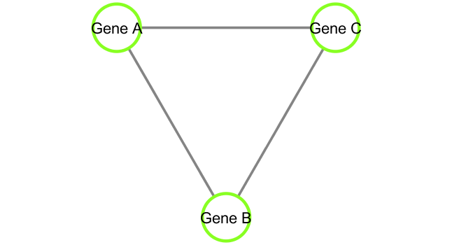
```

<!-- -->


```r
setVisualStyle(cwd, "Marquee")
```

```
## network visual style has been set to "Marquee"
```


```r
saveImage(cwd,
          file.name="demo_marquee",
          image.type="png",
          h=350)
# import one particular function from package 
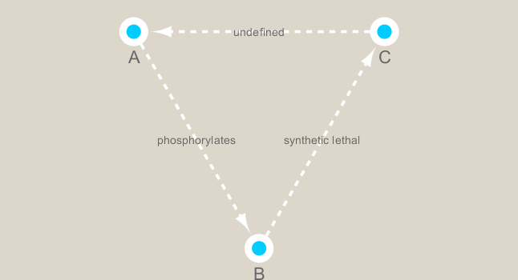
```

<!-- -->


```r
styles <- getVisualStyleNames(cwd)
styles
```

```
##  [1] "default"              "BioPAX"               "Ripple"              
##  [4] "Sample1"              "Solid"                "Big Labels"          
##  [7] "Curved"               "Sample3"              "Minimal"             
## [10] "Nested Network Style" "size_rank"            "default black"       
## [13] "Universe"             "Marquee"              "BioPAX_SIF"          
## [16] "Gradient1"            "Directed"             "Sample2"
```


```r
#setVisualStyle(cwd, styles[13])
#setVisualStyle(cwd, styles[18])
```


```r
## scripts for processing located in "inst/data-raw/"
prok_vir_cor <- read.delim("./data/virus_prok_cor_abundant.tsv", stringsAsFactors = FALSE)

## Have a peak at the first 6 rows
head(prok_vir_cor)
```

```
##       Var1          Var2    weight
## 1  ph_1061 AACY020068177 0.8555342
## 2  ph_1258 AACY020207233 0.8055750
## 3  ph_3164 AACY020207233 0.8122517
## 4  ph_1033 AACY020255495 0.8487498
## 5 ph_10996 AACY020255495 0.8734617
## 6 ph_11038 AACY020255495 0.8740782
```


```r
g <- graph.data.frame(prok_vir_cor, directed = FALSE)

class(g)
```

```
## [1] "igraph"
```

```r
g
```

```
## IGRAPH e962d0e UNW- 845 1544 -- 
## + attr: name (v/c), weight (e/n)
## + edges from e962d0e (vertex names):
##  [1] ph_1061 --AACY020068177 ph_1258 --AACY020207233
##  [3] ph_3164 --AACY020207233 ph_1033 --AACY020255495
##  [5] ph_10996--AACY020255495 ph_11038--AACY020255495
##  [7] ph_11040--AACY020255495 ph_11048--AACY020255495
##  [9] ph_11096--AACY020255495 ph_1113 --AACY020255495
## [11] ph_1208 --AACY020255495 ph_13207--AACY020255495
## [13] ph_1346 --AACY020255495 ph_14679--AACY020255495
## [15] ph_1572 --AACY020255495 ph_16045--AACY020255495
## + ... omitted several edges
```

plotting data


```r
plot(g)
```

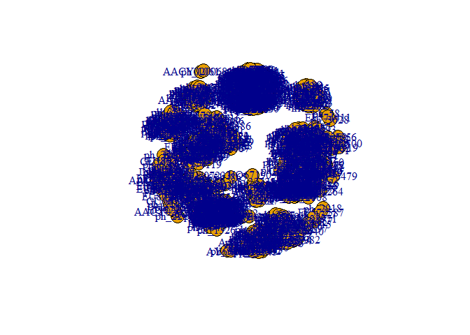<!-- -->

tidying up data by adjusting defaults


```r
# turning off blue labels
plot(g, vertex.label = NA)
```

<!-- -->

```r
# reducing vertex size
plot(g, vertex.size = 3, vertex.label = NA)
```

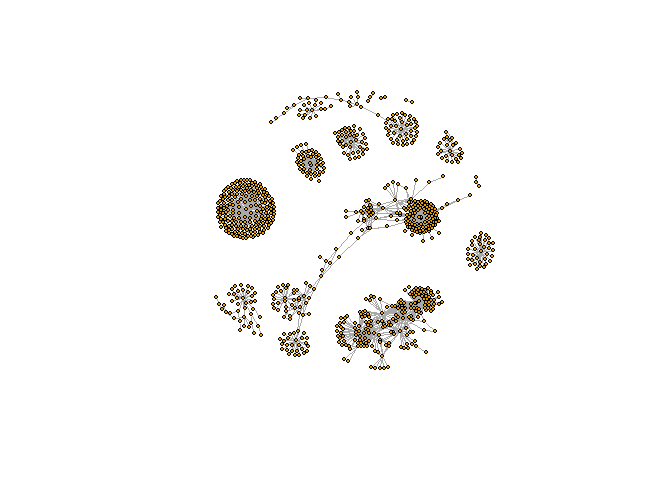<!-- -->

ggplot graph


```r
ggraph(g, layout = 'auto') +
  geom_edge_link(alpha = 0.25) +
  geom_node_point(color="lightblue")
```

```
## Using `nicely` as default layout
```

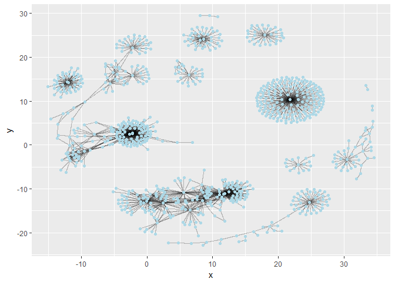<!-- -->

## Network querys

Vertex attributes


```r
V(g)
```

```
## + 845/845 vertices, named, from e962d0e:
##   [1] ph_1061       ph_1258       ph_3164       ph_1033       ph_10996     
##   [6] ph_11038      ph_11040      ph_11048      ph_11096      ph_1113      
##  [11] ph_1208       ph_13207      ph_1346       ph_14679      ph_1572      
##  [16] ph_16045      ph_1909       ph_1918       ph_19894      ph_2117      
##  [21] ph_2231       ph_2363       ph_276        ph_2775       ph_2798      
##  [26] ph_3217       ph_3336       ph_3493       ph_3541       ph_3892      
##  [31] ph_4194       ph_4602       ph_4678       ph_484        ph_4993      
##  [36] ph_4999       ph_5001       ph_5010       ph_5286       ph_5287      
##  [41] ph_5302       ph_5321       ph_5643       ph_6441       ph_654       
##  [46] ph_6954       ph_7389       ph_7920       ph_8039       ph_8695      
## + ... omitted several vertices
```

Edge attributes


```r
E(g)
```

```
## + 1544/1544 edges from e962d0e (vertex names):
##  [1] ph_1061 --AACY020068177 ph_1258 --AACY020207233
##  [3] ph_3164 --AACY020207233 ph_1033 --AACY020255495
##  [5] ph_10996--AACY020255495 ph_11038--AACY020255495
##  [7] ph_11040--AACY020255495 ph_11048--AACY020255495
##  [9] ph_11096--AACY020255495 ph_1113 --AACY020255495
## [11] ph_1208 --AACY020255495 ph_13207--AACY020255495
## [13] ph_1346 --AACY020255495 ph_14679--AACY020255495
## [15] ph_1572 --AACY020255495 ph_16045--AACY020255495
## [17] ph_1909 --AACY020255495 ph_1918 --AACY020255495
## [19] ph_19894--AACY020255495 ph_2117 --AACY020255495
## + ... omitted several edges
```

## Network community detection

Detecting an isolated cluster within the network


```r
cb <- cluster_edge_betweenness(g)
```

```
## Warning in cluster_edge_betweenness(g): At community.c:460 :Membership
## vector will be selected based on the lowest modularity score.
```

```
## Warning in cluster_edge_betweenness(g): At community.c:467 :Modularity
## calculation with weighted edge betweenness community detection might not
## make sense -- modularity treats edge weights as similarities while edge
## betwenness treats them as distances
```

```r
cb
```

```
## IGRAPH clustering edge betweenness, groups: 18, mod: 0.82
## + groups:
##   $`1`
##   [1] "ph_1061"       "AACY020068177"
##   
##   $`2`
##    [1] "ph_1258"       "ph_5861"       "ph_7172"       "ph_11569"     
##    [5] "ph_1291"       "ph_1600"       "ph_2702"       "ph_5790"      
##    [9] "ph_5858"       "ph_7594"       "ph_7816"       "ph_784"       
##   [13] "ph_1359"       "ph_1534"       "ph_1874"       "ph_2465"      
##   [17] "ph_5453"       "ph_900"        "ph_908"        "ph_811"       
##   [21] "ph_1367"       "ph_1452"       "ph_1458"       "ph_1723"      
##   + ... omitted several groups/vertices
```

plotting result


```r
plot(cb, y=g, vertex.label=NA,  vertex.size=3)
```

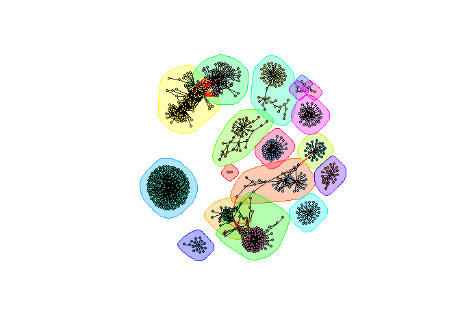<!-- -->

Extracting clusters


```r
head( membership(cb) )
```

```
##  ph_1061  ph_1258  ph_3164  ph_1033 ph_10996 ph_11038 
##        1        2        3        4        4        4
```

## Node/Vertex Degree - number of connections by node

Calculating degree (number of adjacent edges) of a node/vertex


```r
d <- degree(g)
hist(d, breaks=30, col="lightblue", main ="Node Degree Distribution")
```

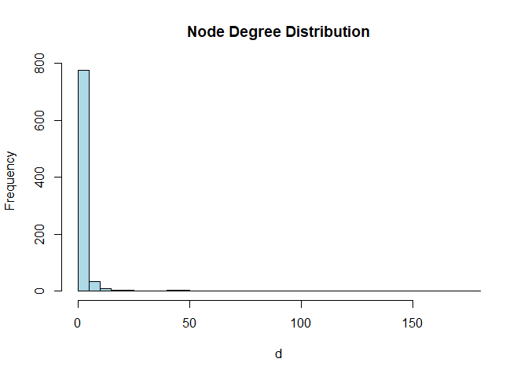<!-- -->

Degree distribution - relative distribution of connections amongst nodes?


```r
plot( degree_distribution(g), type="h" )
```

<!-- -->

## Centrality analysis - how important a node or edge is for overall connectivity (information flow) of network

Determining connectivity with PageRank algorithm


```r
pr <- page_rank(g)
head(pr$vector)
```

```
##      ph_1061      ph_1258      ph_3164      ph_1033     ph_10996 
## 0.0011834320 0.0011599483 0.0019042088 0.0005788564 0.0005769663 
##     ph_11038 
## 0.0005745460
```

Plotting PageRank centrality and Degree plots


```r
v.size <- BBmisc::normalize(pr$vector, range=c(2,20), method="range")
plot(g, vertex.size=v.size, vertex.label=NA)
```

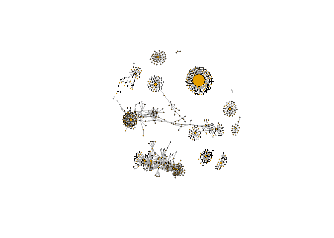<!-- -->


```r
v.size <- BBmisc::normalize(d, range=c(2,20), method="range")
plot(g, vertex.size=v.size, vertex.label=NA)
```

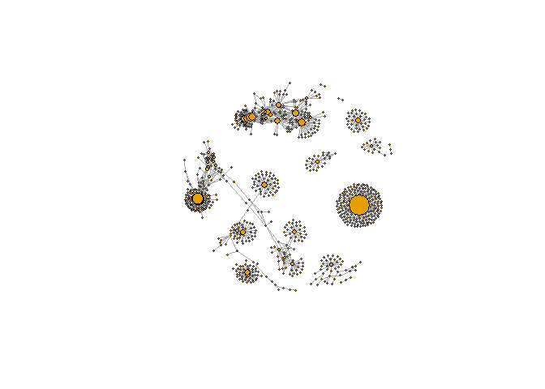<!-- -->


```r
b <- betweenness(g)
v.size <- BBmisc::normalize(b, range=c(2,20), method="range")
plot(g, vertex.size=v.size, vertex.label=NA)
```

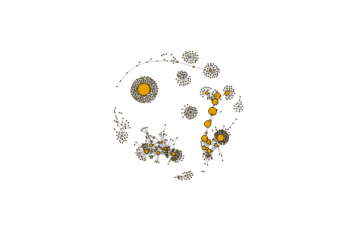<!-- -->

# Read Taxonomic classification for network annotation

Importing next data sets


```r
phage_id_affiliation <- read.delim("./data/phage_ids_with_affiliation.tsv")
head(phage_id_affiliation)
```

```
##   first_sheet.Phage_id first_sheet.Phage_id_network phage_affiliation
## 1        109DCM_115804                       ph_775              <NA>
## 2        109DCM_115804                       ph_775              <NA>
## 3        109DCM_115804                       ph_775              <NA>
## 4        109DCM_115804                       ph_775              <NA>
## 5        109DCM_115804                       ph_775              <NA>
## 6        109DCM_115804                       ph_775              <NA>
##   Domain DNA_or_RNA Tax_order Tax_subfamily Tax_family Tax_genus
## 1   <NA>       <NA>      <NA>          <NA>       <NA>      <NA>
## 2   <NA>       <NA>      <NA>          <NA>       <NA>      <NA>
## 3   <NA>       <NA>      <NA>          <NA>       <NA>      <NA>
## 4   <NA>       <NA>      <NA>          <NA>       <NA>      <NA>
## 5   <NA>       <NA>      <NA>          <NA>       <NA>      <NA>
## 6   <NA>       <NA>      <NA>          <NA>       <NA>      <NA>
##   Tax_species
## 1        <NA>
## 2        <NA>
## 3        <NA>
## 4        <NA>
## 5        <NA>
## 6        <NA>
```


```r
bac_id_affi <- read.delim("./data/prok_tax_from_silva.tsv", stringsAsFactors = FALSE)
head(bac_id_affi)
```

```
##    Accession_ID  Kingdom         Phylum          Class             Order
## 1 AACY020068177 Bacteria    Chloroflexi   SAR202 clade marine metagenome
## 2 AACY020125842  Archaea  Euryarchaeota Thermoplasmata Thermoplasmatales
## 3 AACY020187844  Archaea  Euryarchaeota Thermoplasmata Thermoplasmatales
## 4 AACY020105546 Bacteria Actinobacteria Actinobacteria             PeM15
## 5 AACY020281370  Archaea  Euryarchaeota Thermoplasmata Thermoplasmatales
## 6 AACY020147130  Archaea  Euryarchaeota Thermoplasmata Thermoplasmatales
##              Family             Genus Species
## 1              <NA>              <NA>    <NA>
## 2   Marine Group II marine metagenome    <NA>
## 3   Marine Group II marine metagenome    <NA>
## 4 marine metagenome              <NA>    <NA>
## 5   Marine Group II marine metagenome    <NA>
## 6   Marine Group II marine metagenome    <NA>
```

Add in taxonomic data before sending networks to Cytoscape


```r
## Extract out our vertex names
genenet.nodes <- as.data.frame(vertex.attributes(g), stringsAsFactors=FALSE)
head(genenet.nodes)
```

```
##       name
## 1  ph_1061
## 2  ph_1258
## 3  ph_3164
## 4  ph_1033
## 5 ph_10996
## 6 ph_11038
```

How may phage (i.e. ph_) entries do we have?


```r
length( grep("^ph_",genenet.nodes[,1]) )
```

```
## [1] 764
```

Merging annotation data with network sets


```r
z <- bac_id_affi[,c("Accession_ID", "Kingdom", "Phylum", "Class")]
n <- merge(genenet.nodes, z, by.x="name", by.y="Accession_ID", all.x=TRUE)
head(n)
```

```
##            name  Kingdom          Phylum               Class
## 1 AACY020068177 Bacteria     Chloroflexi        SAR202 clade
## 2 AACY020207233 Bacteria Deferribacteres     Deferribacteres
## 3 AACY020255495 Bacteria  Proteobacteria Gammaproteobacteria
## 4 AACY020288370 Bacteria  Actinobacteria      Acidimicrobiia
## 5 AACY020396101 Bacteria  Actinobacteria      Acidimicrobiia
## 6 AACY020398456 Bacteria  Proteobacteria Gammaproteobacteria
```


```r
# Check on the column names before deciding what to merge
colnames(n)
```

```
## [1] "name"    "Kingdom" "Phylum"  "Class"
```


```r
colnames(phage_id_affiliation)
```

```
##  [1] "first_sheet.Phage_id"         "first_sheet.Phage_id_network"
##  [3] "phage_affiliation"            "Domain"                      
##  [5] "DNA_or_RNA"                   "Tax_order"                   
##  [7] "Tax_subfamily"                "Tax_family"                  
##  [9] "Tax_genus"                    "Tax_species"
```


```r
# Again we only need a subset of `phage_id_affiliation` for our purposes
y <- phage_id_affiliation[, c("first_sheet.Phage_id_network", "phage_affiliation","Tax_order", "Tax_subfamily")]

# Add the little phage annotation that we have
x <- merge(x=n, y=y, by.x="name", by.y="first_sheet.Phage_id_network", all.x=TRUE)

## Remove duplicates from multiple matches
x <- x[!duplicated( (x$name) ),]
head(x)
```

```
##            name  Kingdom          Phylum               Class
## 1 AACY020068177 Bacteria     Chloroflexi        SAR202 clade
## 2 AACY020207233 Bacteria Deferribacteres     Deferribacteres
## 3 AACY020255495 Bacteria  Proteobacteria Gammaproteobacteria
## 4 AACY020288370 Bacteria  Actinobacteria      Acidimicrobiia
## 5 AACY020396101 Bacteria  Actinobacteria      Acidimicrobiia
## 6 AACY020398456 Bacteria  Proteobacteria Gammaproteobacteria
##   phage_affiliation Tax_order Tax_subfamily
## 1              <NA>      <NA>          <NA>
## 2              <NA>      <NA>          <NA>
## 3              <NA>      <NA>          <NA>
## 4              <NA>      <NA>          <NA>
## 5              <NA>      <NA>          <NA>
## 6              <NA>      <NA>          <NA>
```

Add to the network the data related to the connections between the organisms, the edge data, and then prepare to send the nodes and edges to Cytoscape using the function **cyPlot()**.


```r
genenet.nodes <- x
```


```r
genenet.edges <- data.frame(igraph::as_edgelist(g))
names(genenet.edges) <- c("name.1",
                          "name.2")
genenet.edges$Weight <- igraph::edge_attr(g)[[1]]

genenet.edges$name.1 <- as.character(genenet.edges$name.1)
genenet.edges$name.2 <- as.character(genenet.edges$name.2)
genenet.nodes$name <- as.character(genenet.nodes$name)

ug <- cyPlot(genenet.nodes,genenet.edges)
```

Clearing cytoscape window to prepare for new network


```r
cy <- CytoscapeConnection()
deleteAllWindows(cy)
```

Making vector of new data 


```r
cw <- CytoscapeWindow("Tara oceans",
                      graph = ug,
                      overwriteWindow = TRUE)
```

Calling function to plot graph in Cytoscape


```r
displayGraph(cw)
```

```
## [1] "Kingdom"
## [1] "Phylum"
## [1] "Class"
## [1] "phage_affiliation"
## [1] "Tax_order"
## [1] "Tax_subfamily"
## [1] "label"
## [1] "Weight"
```

```r
layoutNetwork(cw)
fitContent(cw)
```

Coloring network by prokaryotic phylum


```r
families_to_colour <- unique(genenet.nodes$Phylum)
families_to_colour <- families_to_colour[!is.na(families_to_colour)]

node.colour <- RColorBrewer::brewer.pal(length(families_to_colour), "Set3")
```

Color things up  


```r
setNodeColorRule(cw,
                 "Phylum",
                 families_to_colour,
                 node.colour,
                 "lookup",
                 default.color = "#ffffff")
```

```
## Successfully set rule.
```

```r
saveImage(cw,
          file.name="net2",
          image.type="png",
          h=350)

library(knitr)
```


```r
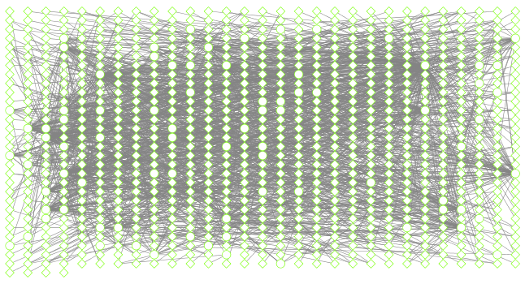
```

<!-- -->

Setting shape to reflect virus or prokaryote


```r
shapes_for_nodes <- c("DIAMOND")

phage_names <- grep("ph_",
                    genenet.nodes$name,
                    value = TRUE)
setNodeShapeRule(cw,
                 "label",
                 phage_names,
                 shapes_for_nodes)
```

```
## Successfully set rule.
```

```r
displayGraph(cw)
```

```
## [1] "Kingdom"
## [1] "Phylum"
## [1] "Class"
## [1] "phage_affiliation"
## [1] "Tax_order"
## [1] "Tax_subfamily"
## [1] "label"
## [1] "Weight"
```

```r
fitContent(cw)
```

Color edges of phage nodes


```r
setDefaultNodeBorderWidth(cw, 5)
families_to_colour <- c("Podoviridae",
                        "Siphoviridae",
                        "Myoviridae")

node.colour <- RColorBrewer::brewer.pal(length(families_to_colour),
                          "Dark2")
setNodeBorderColorRule(cw,
                       "Tax_subfamily",
                       families_to_colour,
                       node.colour,
                       "lookup", 
                       default.color = "#000000")
```

```
## Successfully set rule.
```

```r
displayGraph(cw)
```

```
## [1] "Kingdom"
## [1] "Phylum"
## [1] "Class"
## [1] "phage_affiliation"
## [1] "Tax_order"
## [1] "Tax_subfamily"
## [1] "label"
## [1] "Weight"
```

```r
fitContent(cw)

saveImage(cw,
          "co-occur2",
          "png",
          h=350)
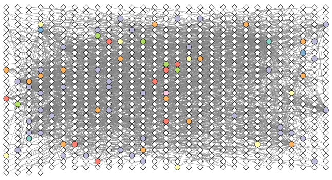
```

<!-- -->

Cleaning up network - changing layout with R code


```r
getLayoutNames(cw)
```

```
##  [1] "attribute-circle"      "stacked-node-layout"  
##  [3] "degree-circle"         "circular"             
##  [5] "attributes-layout"     "kamada-kawai"         
##  [7] "force-directed"        "cose"                 
##  [9] "grid"                  "hierarchical"         
## [11] "fruchterman-rheingold" "isom"                 
## [13] "force-directed-cl"
```


```r
getLayoutPropertyNames(cw, layout.name="force-directed")
```

```
## [1] "numIterations"            "defaultSpringCoefficient"
## [3] "defaultSpringLength"      "defaultNodeMass"         
## [5] "isDeterministic"          "singlePartition"
```


```r
getLayoutPropertyValue(cw, "force-directed", "defaultSpringLength") 
```

```
## [1] 50
```


```r
getLayoutPropertyValue(cw, "force-directed", "numIterations")  
```

```
## [1] 100
```


```r
layoutNetwork(cw, layout.name = "force-directed")
fitContent(cw)
```


```r
## initiate a new node attribute
ug2 <- initNodeAttribute(graph = ug,
                          "degree",
                          "numeric",
                          0.0) 
```


```r
## Use the igraph to calculate degree from the original graph
nodeData(ug2, nodes(ug2), "degree") <- igraph::degree(g)

cw2 <- CytoscapeWindow("Tara oceans with degree",
                      graph = ug2,
                      overwriteWindow = TRUE)

displayGraph(cw2)
```

```
## [1] "Kingdom"
## [1] "Phylum"
## [1] "Class"
## [1] "phage_affiliation"
## [1] "Tax_order"
## [1] "Tax_subfamily"
## [1] "degree"
## [1] "label"
## [1] "Weight"
```

```r
layoutNetwork(cw2)
```


```r
degree_control_points <- c(min(igraph::degree(g)),
                           mean(igraph::degree(g)),
                           max(igraph::degree(g)))
node_sizes <- c(20,
                20,
                80,
                100,
                110) # number of control points in interpolation mode,
                     # the first and the last are for sizes "below" and "above" the attribute seen.

setNodeSizeRule(cw2,
                "degree",
                degree_control_points,
                node_sizes,
                mode = "interpolate")
```

```
## Locked node dimensions successfully even if the check box is not ticked.
## Locked node dimensions successfully even if the check box is not ticked.
## Successfully set rule.
```


```r
layoutNetwork(cw2,
              "force-directed")
```


